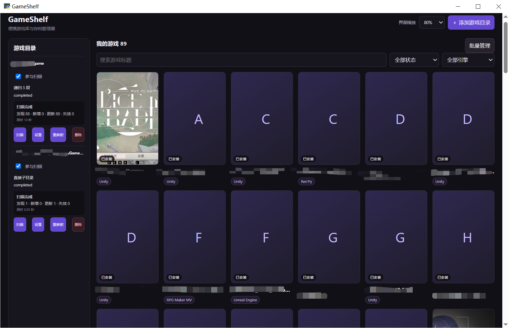
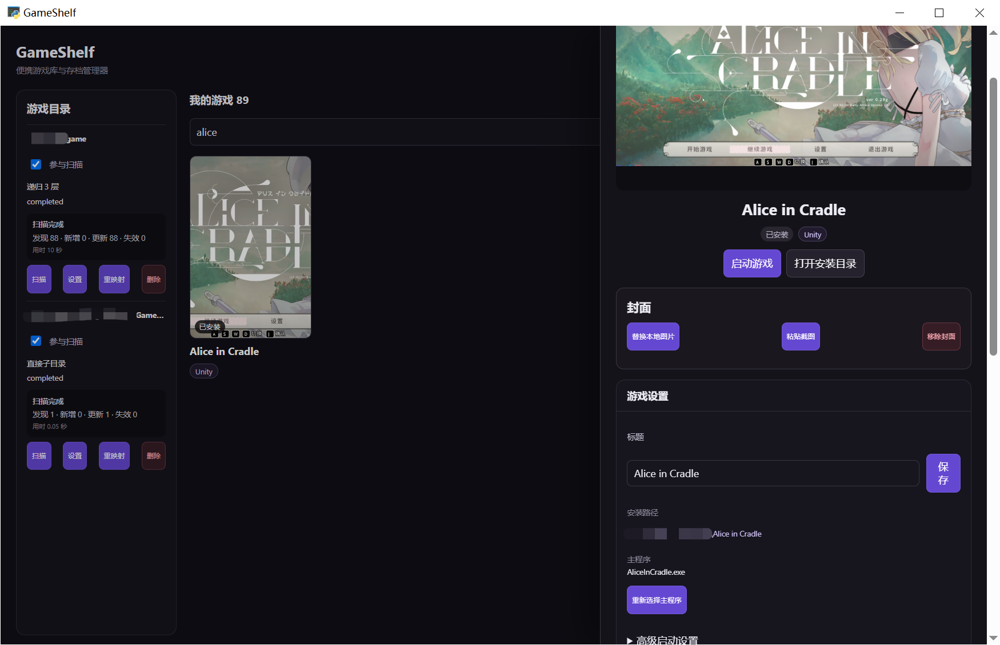
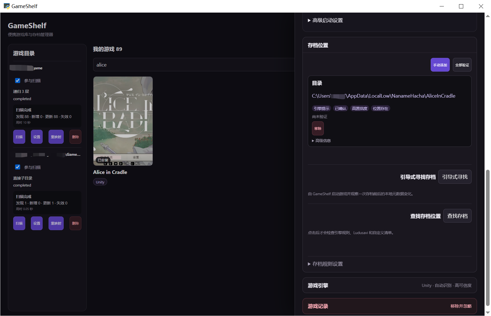

# GameSave Scout

GameSave Scout 是一个面向 Windows 10/11 x64 的本地优先、便携式个人游戏库与存档定位工具，目前主要面向同人游戏，也适用于其他能够独立启动的 Windows 游戏。它用于整理分散在不同目录中的游戏、维护启动配置与封面、识别常见游戏引擎，并帮助用户查找和确认存档位置。

GameSave Scout 不需要账号或云服务。游戏库、配置、封面、日志和 WebView 用户数据默认保存在程序旁的 `data` 目录，可以随整个程序目录迁移。当前源码范围与实现状态见[开发路线图](docs/superpowers/plans/2026-08-12-GameSave-Scout-开发路线图.md)。

> 名称过渡说明：产品与当前维护文档已使用 **GameSave Scout**。为保证 V0.3.2 源码、命令和既有便携产物仍可准确复现，本阶段暂不修改 `GameShelf.exe`、Python 包 `gameshelf`、`GAMESHELF_*` 环境变量及已生成的 `GameShelf-0.3.2-*` 产物名称；这些技术标识将在后续代码改名时统一更新。

## 主要功能

- 管理多个游戏根目录，支持直接子目录或 1～8 层递归扫描、独立排除规则和后台快速核验；
- 编辑游戏标题、主程序、工作目录、启动参数和环境变量，并使用经过验证的配置启动游戏；
- 使用封面网格搜索和筛选游戏，通过主页批量管理一次处理已安装或失效记录，并支持 80%～120% 五档界面缩放；
- 创建、重命名和删除扁平自定义分组；一个游戏可属于多个分组，并支持详情编辑、批量加入/移出以及与搜索、状态、引擎组合筛选；
- 为单个游戏选择、粘贴、替换或移除封面，也可在批量封面工作台中从 VNDB、拖放/粘贴、游戏目录浅层扫描和自定义非递归封面目录收集候选；
- 批量封面不会自动采用图片；VNDB 默认关闭，开启后只发送游戏标题，不发送安装路径或本地文件；
- 主页和批量封面使用固定控制区与内部独立滚动，滚动条采用统一深色主题；
- 通过专用检测器与 74 条带公开依据、正式/实验状态的内置声明式规则识别 Galgame、RPG Maker、Unity、Ren'Py、Unreal、Godot 等引擎，并保留证据和手动覆盖；
- 按需合并用户/内置游戏专属规则、Ludusavi SQLite 索引和 11 条内置引擎存档规则查找静态存档位置，并区分实际“已找到”和尚未创建的“可能路径 / 未发现”；
- 通过独立“规则管理”工作台查看、测试、复制和本地启停内置规则，或用引导表单维护用户引擎规则、游戏专属存档规则和引擎通用存档规则；
- 提供单次引导式存档寻找：先监控文件变化，再启动游戏并由用户完成一次保存，最后审核候选位置；
- 提供用户主动启动的批量存档发现工作台：在受限范围内扫描并审核已安装、本体失效、未关联及已记录位置，可关联现有游戏或创建仅存档卡片；
- 使用程序旁 SQLite 数据库和便携配置，不扫描或上传未授权的全盘内容。

当前源码不包含存档备份、恢复、同步、云服务和常驻后台监控。

## 版本更新记录

以下记录按源码开发里程碑整理；`V0.1.0`、`V0.1.4`、`V0.2.1` 和 `V0.3.2` 已生成本地双版本便携候选包。详细设计、实现边界和验证记录以[固定设计文档](docs/superpowers/plans)为准。

<details open>
<summary><strong>V0.3.2 — 2026-08-25（最新源码与便携候选）</strong></summary>

- 逐项复核固定 GARbro 提交的 228 个 ArcFormats 顶层格式族，从 123 个引擎/系统相关族中筛出并实现 45 条强特征正式规则和 7 条短签名/加密头实验规则；现有安全证据操作无法可靠表达的候选继续留在开发台账；
- 内置引擎规则增至 74 条（66 条正式、8 条实验），新增规则具有资料驱动的正反、近似魔数、截断、复合证据和跨格式碰撞夹具；缺少商业游戏样本的真实矩阵继续后置；
- 存档位置新增 `require_existing`，规则编辑器以“始终建议 / 仅找到时显示”下拉框呈现，并在 schema、序列化、导入导出、本地测试、单游戏查找和批量扫描中保持同一语义；
- 内置存档规则增至 11 条；Ren'Py 只由受限解析器提供安全 `{renpy_save_directory}` 元数据，RPG Maker 各世代与 NScripter 的等价候选已迁入可见、可禁用的 YAML，旧代码分支移除且不产生重复候选；
- 正式发布门禁为 Python 1276 项通过、1 项平台条件跳过，前端 57 个测试文件共 241 项通过，并通过 Ruff、mypy、Vue 类型检查、141 模块生产构建和隔离 schema 4 源码 smoke；
- 从干净提交 `55d8024` 构建完整离线版和轻量联网版，两个冻结 smoke、清单、模式隔离、无 `data`、ZIP 与 SHA-256 独立复核通过；完整版/轻量版 ZIP 为 326.15/35.23 MiB。

</details>

<details>
<summary><strong>V0.3.1 — 2026-08-23</strong></summary>

- 新增与游戏库、批量存档同级的“规则管理”工作台，提供引擎规则、存档规则和 Ludusavi 三个标签；常规窗口使用列表/详情双滚动区，窄窗口改为分步操作；
- 内置规则保持只读，可测试、复制、导出和本地禁用；用户规则使用一条规则一个 YAML 文件，支持新建、编辑、复制、启停、删除、批量导入导出和失败诊断；
- 引导表单只开放白名单证据操作、路径模板、注册表根和元数据令牌，不执行 YAML 中的命令、脚本或 SQL；规则保存/刷新失败继续使用最近有效的不可变快照；
- 游戏分析、单游戏查找和批量存档扫描在任务开始时捕获规则快照；编辑只影响下一次任务，不自动重扫游戏库或存档目录；
- 游戏详情可预填“游戏专属存档规则”；Ludusavi 更新、恢复随包版本和活动/随包状态集中到规则管理，联网更新仍只由用户显式触发；
- 规则资源统一到 `resources/rules` 和 `data/rules`；旧 `resources/manifests` 与 `data/manifests/custom` 不再加载或创建，只在检测到时提示，不迁移也不自动删除；
- 版本统一为 0.3.1，SQLite schema 保持 4；完整自动门禁为 Python 1057 项通过、1 项平台条件跳过，前端 56 个测试文件共 234 项通过，并通过 Ruff、mypy、Vue 类型检查、141 模块生产构建和隔离 schema 4 源码 smoke；
- 2026-08-25 已完成真实 pywebview 规则工作台验收；缺少样本的真实游戏矩阵继续后置。V0.3.1 未单独构建便携包，相应功能随后随 V0.3.2 进入最新候选。

</details>

<details>
<summary><strong>V0.3.0 — 2026-08-21</strong></summary>

- 建立引擎与存档“双规则库 + 共享基础层”，统一稳定 ID、来源、正式/实验状态、版本、优先级、公开依据和严格结构校验；
- 校准 QLIE、Majiro、Malie、ShiinaRio、SoftPal/AmuseCraft、Entis/ERI/NOA、Nitroplus 七个旧实验引擎：除证据仍不足的 SoftPal/AmuseCraft 保持实验外，其余六项转为正式；
- 新增正式 LiveMaker、CMVS/CVNS 和 Godot 识别，并使用正向与相似结构负向最小夹具限制误报；
- 新增内置存档规则库和 Godot、Unity、Unreal 通用规则，补强 Ren'Py、KiriKiri、NScripter、RPG Maker、WOLF 等代码型提示；缺少可靠路径依据时不猜测；
- 单游戏静态查找只在用户点击后运行，依次合并自定义清单、内置游戏规则、Ludusavi SQLite、内置与代码型引擎规则；实际存在和仅可推导路径分组显示，同一路径合并全部来源证据；
- 批量存档扫描复用同一个内置 provider，只把实际存在的目录、文件、glob 或注册表键加入候选，并可按“内置规则”筛选；接受后继续使用兼容持久来源 `engine`，schema 保持 4；
- 引擎诊断工具新增显式 `--sanitized` 模式，限制为相对路径、256 项/深度 3 概况、16 字节魔数和根级 EXE PE 字段；真实数据库复核使用 SQLite 只读 immutable 模式，未改写数据库；
- 完整源码门禁通过：Python 963 项、前端 48 个测试文件共 197 项，并通过 Ruff、mypy、Vue 类型检查、115 模块生产构建和隔离 schema 4 源码 smoke；
- V0.3.x 下一项是独立的引导式自定义规则编辑器；V0.3.0 不包含该编辑器、数据库迁移或新便携包。

</details>

<details>
<summary><strong>V0.2.1 — 2026-08-20</strong></summary>

- 新增独立“批量存档”一级工作台；扫描只在用户确认后启动，并与游戏库 quick/full 磁盘扫描互斥；
- 使用自定义清单、完整 Ludusavi 路径反向索引、引擎提示、已记录位置与受限元数据扫描生成候选，结果覆盖已安装、本体失效、未关联、已记录、已忽略和不可用状态；完全无法识别名称时标题才显示“未知游戏”；
- 候选与逐次观察跨扫描持久化，支持证据、自动组合筛选、分页、取消后保留部分结果、不可访问与截断摘要，以及忽略、恢复和安全清理不可用记录；状态、可信度和来源立即应用，关键词停止输入 300ms 后应用；
- 扫描设置使用锚定浮层，点击内部保持打开，点击外部关闭且不清空本次临时范围；
- 支持批量接受、调整关联和创建 `save_only` 仅存档卡片；存档位置、候选状态、可选引擎及多个分组均以单事务写入，注册表候选要求额外确认；
- VNDB、DLsite 和 2DFan 仅在用户点击后以界面显示的作品 ID 或关键词打开系统浏览器，不进行后台抓取，也不发送本地路径；
- 数据库升级为 schema 4、配置升级为版本 5。开发阶段不提供 schema 3 迁移，旧库必须由用户自行移走或删除；
- 完整自动门禁通过：Python 858 项、前端 48 个测试文件共 193 项，并通过 Ruff、mypy、Vue 类型检查、115 模块生产构建和 schema 4 源码 smoke；
- 真实 pywebview 已完成扫描、分类、审核、仅存档卡片、五档缩放和三类窗口尺寸验收；从干净提交 `184ac7a` 构建的完整离线版与轻量联网版已通过两版冻结 smoke、清单、ZIP、SHA-256、模式隔离和无 `data` 复核，但尚未上传 GitHub Release。

</details>

<details>
<summary><strong>V0.2.0 — 2026-08-19</strong></summary>

- 新增扁平自定义游戏分组，支持新建、重命名、删除和成员数量展示；一个游戏可同时属于多个分组；
- 主页新增“全部分组”“未分组”和具体分组筛选，并与标题、状态和引擎条件共同取交集；
- 详情抽屉支持原子替换单个游戏的全部分组，主页批量管理支持把最多 500 个游戏加入或移出一个分组；
- `installed`、`missing` 和 `save_only` 均可参与分组；选择含仅存档记录时仍可调整分组，但批量删除会禁用并说明原因；
- 数据库升级为 schema 3。开发阶段不提供 schema 2 迁移，旧库必须由用户自行移走或删除后重新建立，程序不会自动改动旧数据库或 `data/covers` 文件；
- 完整自动门禁通过：Python 743 项、前端 38 个测试文件共 169 项，并通过 Ruff、mypy、Vue 类型检查、生产构建和隔离 schema 3 源码 smoke；
- 本条只表示 V0.2.0 源码里程碑，尚未构建或发布 V0.2.0 便携包。

</details>

<details>
<summary><strong>V0.1.4 — 2026-08-18</strong></summary>

- 启动快速核验改为只检查已入库游戏，并可全局关闭；手动完整扫描继续负责发现新游戏；
- 新增持久化游戏分析缓存、文件指纹分层失效和 1～4 全局共享分析并发，减少未变化游戏的重复遍历；
- 新增 quick/full 分阶段进度、缓存统计、扫描中耗时和单游戏“重新检测主程序和引擎”；
- 新根目录默认排除 `Mods` 与 `**/Mods`，规则可由用户删除；相关自动门禁和 10 项真实人工验收全部通过。
- 从干净提交 `fc540ea` 重建完整离线版与轻量联网版；构建内部通过 Python 717 项、前端 142 项和两版冻结 smoke，发布清单记录 `gitDirty: false`。

</details>

<details>
<summary><strong>V0.1.3 — 2026-08-18</strong></summary>

- 游戏标题与版本号改为独立保存、展示和搜索，扫描时保守识别目录名中的明确版本尾缀；
- 重扫和移动确认分别维护自动检测值与用户设置，避免覆盖手动标题、版本号、主程序或引擎；
- VNDB 当前游戏与批量搜索只发送纯游戏标题，不携带版本号、本地路径或其他本地信息；
- 修复批量 VNDB 搜索过程中切换审核游戏后进度停留的问题。

</details>

<details>
<summary><strong>V0.1.2 — 2026-08-17</strong></summary>

- 主页游戏目录、游戏网格、批量封面队列和候选画廊改为独立滚动，关键控制区保持固定；
- 候选设置改为锚定浮层，并为应用内滚动区域统一深色滚动条；
- 优化五档界面缩放及窄窗口布局，限制横向、纵向封面始终位于详情标题上方；
- 修复批量封面队列项目较多或标题换行时条目压缩、重叠的问题。

</details>

<details>
<summary><strong>V0.1.1 — 2026-08-17</strong></summary>

- 新增批量封面工作台，可从 VNDB、拖放/粘贴、游戏目录浅层扫描和自定义非递归封面目录收集候选；
- 所有候选均由用户逐项确认采用，联网默认关闭，在线请求不发送安装路径或本地文件；
- 增加批量任务进度、取消、临时候选清理和单项失败隔离；
- 优化 VNDB 批量进度、浅层扫描空结果提示、主页批量入口间距和详情封面显示边界。

</details>

<details>
<summary><strong>V0.1.0 — 2026-08-16</strong></summary>

- 完成多游戏根目录扫描、安全启动、主程序排序、常见游戏引擎识别和手动覆盖；
- 完成游戏库筛选、详情设置、封面管理、界面缩放和事务式批量管理；
- 完成基于自定义清单、Ludusavi 索引和引擎提示的静态存档查找，以及引导式文件变化监控；
- 建立完整离线版和轻量联网版 Windows x64 便携构建、校验与本机验收流程。

</details>

## 当前状态

V0.1.x、V0.2.0、V0.2.1 和 V0.3.2 已完成既定源码与验收收口；V0.3.2 是最新本地双版本便携候选。V0.3.1 自定义规则编辑器及真实 pywebview 工作台验收已完成，V0.3.2 第二批引擎与存档规则及便携构建也已完成，schema 保持 4；缺少样本的真实游戏规则矩阵仍保留为后续工作。完整目标 Windows 10/11 设备、SmartScreen、UNC/只读目录和特殊运行时故障矩阵没有全部执行，作为后续可选兼容性复核。

V0.2 批量存档发现展示已安装、失效、未关联及已记录存档位置，而不只显示“孤立”结果；候选始终由用户审核，不自动确认归属。存档备份、恢复、同步和版本管理继续后置，目前尚未实现。

## 规则管理

左侧选择“规则管理”后，可以在三个标签间切换：

- “引擎规则”：查看内置规则，或新建用户引擎识别规则；保存后在下一次“重新检测”或完整扫描时生效。
- “存档规则”：维护按精确游戏身份匹配的游戏专属规则，以及按已识别引擎推导位置的引擎通用规则；保存后在下一次“查找存档”或批量扫描时生效。
- “Ludusavi”：查看随包/活动快照版本，显式检查更新、恢复随包版本或打开用户规则目录；程序启动不会联网更新。

随包只读资源位于 `resources/rules/builtin`、`resources/rules/schemas` 和 `resources/rules/ludusavi`。用户规则、内置启停设置和主动更新后的 Ludusavi 活动快照位于 `data/rules`；发布包不预置 `data`，首次运行只创建空用户目录，也不会把随包 Ludusavi 复制到活动目录。

## 界面预览

### 游戏库概览



扫描多个游戏目录，在封面网格中搜索、筛选和管理已识别的游戏。

### 游戏详情与启动设置



在右侧详情面板中启动游戏、管理封面，并调整标题、主程序和其他启动设置。

### 存档位置与引擎识别



集中维护已确认的存档目录，按需查找或引导式寻找存档，并查看游戏引擎识别结果。

## 便携版选择与使用

当前 V0.3.2 提供两个本地 Windows x64 便携候选包；尚未上传 GitHub Release：

| 版本 | 目录/ZIP 名称 | WebView2 | 适用场景 |
| --- | --- | --- | --- |
| 完整离线版 | `GameShelf-0.3.2-win-x64` | 自带 Fixed Version Runtime | 体积较大，可在系统没有 WebView2 时离线启动 |
| 轻量联网版 | `GameShelf-0.3.2-win-x64-lite` | 使用系统 Evergreen Runtime | 下载体积较小，系统缺失 Runtime 时需要联网手动安装 |

使用步骤：

1. 将 ZIP 完整解压到本地固定磁盘上的可写目录，不要直接在压缩包内运行。
2. 保持 `GameShelf.exe`、`_internal` 以及完整版的 `runtime` 或轻量版的 `prerequisites` 相对位置不变。
3. 双击 `GameShelf.exe` 启动。首次正常启动会在程序旁创建 `data`。
4. 添加一个或多个游戏根目录并执行扫描；游戏详情中可以继续设置启动方式、封面、引擎和存档位置。

轻量版如果检测不到系统 Evergreen WebView2 Runtime，会先校验随包的微软官方 `MicrosoftEdgeWebview2Setup.exe`，再询问是否打开安装位置。选择“是”后，GameSave Scout 只会在 Explorer 中选中安装器并正常退出；请手动双击安装器联网完成安装，然后重新启动 GameSave Scout。GameSave Scout 不会静默运行安装器，也不会自动重新启动自身。

便携使用注意事项：

- 完全退出 GameSave Scout 后，复制整个程序目录即可迁移；不要只移动 `GameShelf.exe`。
- 删除整个 GameSave Scout 目录即可删除程序及其便携数据；轻量版使用的系统 Evergreen Runtime 不会随之卸载。
- 当前便携包只支持本地文件系统中的可写目录，且完整发布负载的绝对路径必须少于 260 个字符；不支持 UNC 或网络共享路径。
- 启动错误日志位于 `data\logs\startup-error.log`，普通运行日志位于 `data\logs\gameshelf.log`。
- 当前 GameSave Scout 本体未进行 Authenticode 签名，Windows 可能显示未知发布者或 SmartScreen 提示。请只使用可信来源的发布包并核对 ZIP 的 SHA-256，不要为运行程序而关闭系统安全功能。

## 开发环境

- Git 与 PowerShell
- Conda（Anaconda、Miniconda 或兼容发行版）
- 项目内 Conda 环境：Python 3.12、Node.js 24

以下命令均在项目根目录执行。首次开发时创建项目内 `.venv` 环境并安装依赖：

```powershell
conda create --prefix .\.venv --override-channels -c conda-forge python=3.12 nodejs=24 -y
conda activate .\.venv
python -m pip install -e ".[dev]"
npm --prefix frontend ci
```

`.venv` 同时提供项目所需的 Python 和 Node.js，不需要修改系统中已有的 Node.js。以后重新打开终端时，只需先进入项目根目录并激活环境：

```powershell
conda activate .\.venv
```

当前 V0.3.2 源码和便携候选包均使用 SQLite schema 4，并按开发期约定不迁移 schema 1/2/3 数据库。如果程序提示检测到旧库，请先完全退出 GameSave Scout，再自行移走或删除可舍弃的 `data\library.db` 后重启。该操作会丢失旧数据库记录；程序不会自动删除 `data\covers` 中的图片，但新库也不会自动恢复旧封面关联。

后端检查：

```powershell
python -m pytest
python -m ruff check src tests scripts
python -m mypy src scripts
```

前端检查与生产构建：

```powershell
npm --prefix frontend run test:unit -- --run
npm --prefix frontend run type-check
npm --prefix frontend run build
```

前端生产构建会直接更新 `resources/ui`。随后可以在不打开窗口的情况下验证便携路径与数据库：

```powershell
python -m gameshelf --smoke-test
```

## 构建 Windows x64 便携包

正式构建需要两个微软官方输入文件：

- WebView2 Fixed Version Runtime 151.0.4129.86 x64 CAB，用于完整离线版；
- Evergreen WebView2 Bootstrapper，用于轻量联网版缺少系统 Runtime 时的手动安装引导。

构建脚本要求两个参数都是绝对路径，并会按照 `release/webview2-runtime.json` 和 `release/webview2-bootstrapper.json` 校验文件名、版本、SHA-256 与 Microsoft Authenticode 签名。脚本不会联网下载输入，也不会自动运行安装器。仓库约定把本地输入放在被 Git 忽略的 `webview安装包` 目录：

```text
webview安装包/
├─ Microsoft.WebView2.FixedVersionRuntime.151.0.4129.86.x64.cab
└─ MicrosoftEdgeWebview2Setup.exe
```

在已经激活 `.venv` 的项目根目录 PowerShell 中执行：

```powershell
$webView2Archive = (Resolve-Path ".\webview安装包\Microsoft.WebView2.FixedVersionRuntime.151.0.4129.86.x64.cab").Path
$webView2Bootstrapper = (Resolve-Path ".\webview安装包\MicrosoftEdgeWebview2Setup.exe").Path

.\scripts\build_release.ps1 `
  -WebView2Archive $webView2Archive `
  -WebView2Bootstrapper $webView2Bootstrapper
```

脚本会执行 Python 与前端完整门禁、生产 UI 构建、源码 smoke、单次 PyInstaller onedir 冻结、两种 WebView2 布局派生、两版冻结 smoke、发布清单与 ZIP 复核。只有六个目标全部成功后，才会原子替换 `dist` 中的当前版本：

```text
dist/
├─ GameShelf-0.3.2-win-x64/
├─ GameShelf-0.3.2-win-x64.zip
├─ GameShelf-0.3.2-win-x64.zip.sha256
├─ GameShelf-0.3.2-win-x64-lite/
├─ GameShelf-0.3.2-win-x64-lite.zip
└─ GameShelf-0.3.2-win-x64-lite.zip.sha256
```

可以独立复核两个 ZIP：

```powershell
Get-FileHash .\dist\GameShelf-0.3.2-win-x64.zip -Algorithm SHA256
Get-Content .\dist\GameShelf-0.3.2-win-x64.zip.sha256

Get-FileHash .\dist\GameShelf-0.3.2-win-x64-lite.zip -Algorithm SHA256
Get-Content .\dist\GameShelf-0.3.2-win-x64-lite.zip.sha256
```

2026-08-25 本地 V0.3.2 候选包的 ZIP SHA-256 为：

- 完整离线版：`af4c7b50236a25ed0f3529e6466078904b8b20a910d93af26ee39ee40491e252`
- 轻量联网版：`181dbb7156b97778a7739dac59baa3107d99decaa94cced7bb8d387d628880bb`

构建失败时，脚本不会用不完整的新结果覆盖上一组六个正式产物。`build/`、`dist/` 与 `webview安装包/` 都是本地内容，不应提交到 Git。

## 源码启动与调试

在项目根目录打开 PowerShell，激活项目环境并启动桌面程序：

```powershell
conda activate .\.venv
python -m gameshelf
```

该命令会加载已经构建到 `resources/ui` 的前端。如果修改过前端源码，应先执行 `npm --prefix frontend run build`。

需要前端热更新时，打开两个已经激活 `.venv` 的 PowerShell 窗口。第一个窗口启动 Vite：

```powershell
npm --prefix frontend run dev -- --host 127.0.0.1
```

第二个窗口让桌面程序加载 Vite 页面：

```powershell
$env:GAMESHELF_DEV_SERVER_URL = "http://127.0.0.1:5173"
python -m gameshelf
```

如果 Vite 因端口占用显示了其他地址，应把 `GAMESHELF_DEV_SERVER_URL` 改为终端中实际显示的地址。冻结版会忽略该变量并只加载随包 UI。

## 项目文档与许可证

- [总体设计](docs/superpowers/specs/2026-08-12-GameSave-Scout-总体设计.md)
- [开发路线图](docs/superpowers/plans/2026-08-12-GameSave-Scout-开发路线图.md)
- [封面与游戏库界面](docs/superpowers/plans/2026-08-12-GameSave-Scout-03-封面与游戏库界面.md)
- [静态存档位置](docs/superpowers/plans/2026-08-12-GameSave-Scout-05-静态存档位置.md)
- [引导式与批量存档发现](docs/superpowers/plans/2026-08-12-GameSave-Scout-06-动态与孤立存档发现.md)
- [便携版打包与发布设计](docs/superpowers/plans/2026-08-12-GameSave-Scout-07-便携版打包与发布.md)
- [MIT License](LICENSE)
- [第三方声明](THIRD_PARTY_NOTICES.md)
